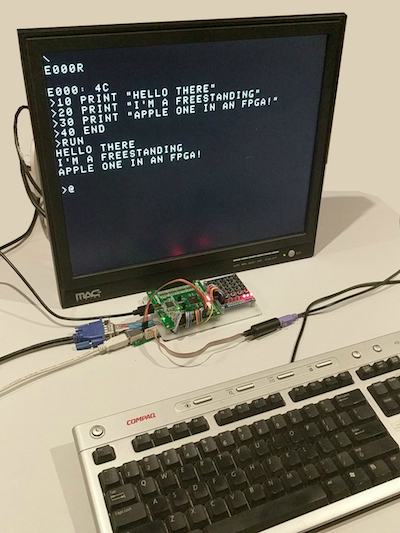

This project is based on the awesome work of [Alan Garfield](https://github.com/alangarf/apple-one), expanded and modified by me.

This is an implementation of the original Apple 1 in Verilog. It can run the Apple 1 WozMon, a1ASM, Integer Basic and ehBasic via VGA 640x480 video with PS/2 keyboard standalone. So far fully tested and supported boards are:
- [RZ-EasyFPGA A2.1](http://fpga.redliquid.pl/)

 

This project borrows heavily from the *awesome* work of Andrew Holme and his ["Pool"](http://www.aholme.co.uk/6502/Main.htm) project and [Arlet Otten's](https://github.com/Arlet/verilog-6502) tiny 6502 core. Also many special thanks to ["sbprojects.com"](https://www.sbprojects.com/projects/apple1/index.php) for the wealth of information Alan gleaned from there.

## Memory Map
 
The memory map has the inital setup:

 Start |  End   | Description
 ----- | ------ | -----------
0x0000 | 0xFFFF | 64KB of block RAM for system
0xD010 | 0xD011 | Keyboard IN   (UART like)
0xD012 | 0xD013 | Char OUT      (UART like)
0xD014 | 0xD015 | UART RX       (115200 boud)
0xD016 | 0xD017 | UART TX
0xD018 | 0xD019 | MMU           (0xD019 for later use)
0xD020 | 0xD023 | VGA Controller
0xF000 | 0xFFFF | WozMon ROM

## MMU / Glue logic

The MMU/Glue is managing the whole bus and peripherials.
Basicly the whole system is RAM except the different ROMs, which can be mapped in their memory locations.

 Start |  End   | Description
 ----- | ------ | -----------
0x0000 | 0xFFFF | RAM
0x9000 | 0xB9FF | ehBasic       (can be switched off)
0xE000 | 0xEFFF | Apple1 ASM    (can be switched off)
0xE000 | 0xEFFF | Apple1 Basic  (can be switched off)
0xF000 | 0xFFFF | WOZ Mon       (can't  switched off)

Mapping the ROMs:
 Addr  | Data  | Description
 ----- | ----- | -----------
0xD018 | 0x00  | RAM
0xD018 | 0x01  | Apple1 Basic on/off
0xD018 | 0x02  | Apple1 ASM   on/off
0xD018 | 0x04  | ehBasic      on/off

eg.
@D018:04
D018:  00
@D018
D018:  04
@9000R

ehBasic is enabled on 0x9000 and starting.
Please note: If you're setting the a new bitmask in the MMU, WOZMon will return the old bitmask.
Don't worry, your bitmask is set and you can check it by reading  0xD018 again.

## Building

You can build this project with the quartus free and web editions.

## The BACKSPACE key and how to delete typos

The Apple 1 didn't have a typical "backspace" key as we are use to today, due to the way the video display worked it couldn't move the cursor backward to erase characters. So instead it used a "rubout" character, which is the underscore character (_). This character signifies that the input buffer has been moved backwards one character (eg. `PRN_INT` would be received by the Apple 1 as `PRINT`).

It takes a little getting used to but you'll soon get the hang of it.

## The Apple 1 only understands UPPERCASE characters

If you're using the PS/2 input you don't need to be worried about this, as we automatically UPPERCASE all typed characters so WozMon can understand what you are typing.

However if you are using the UART and a serial terminal you will need to remember to turn on your CAPSLOCK, otherwise nothing will respond as you might expect.

## Serial Setup
 
Depending on the board you can use serial to communicate with the Apple 1, some boards require a toggle to be set to select between PS/2 input and UART input. The UART by default will be set to 115200 (8/N/1).
 
A very basic hardware flow control is implemented. You should turn on CTS support as this will allow you to cut and paste code into the Woz Mon without the Apple 1 missing any bytes.

 
## VGA / PS/2 Setup
 
Most boards support PS/2 input and VGA output. This is the most support method, however all output is replicated to the UART (if available) and the PS/2 keyboard input can be replaced with the UART out if the "toggle" mode buttons is selected.

Unlike the original Apple 1 this implementation can (depending on board you are using and it's support) change the foreground and background colours of the VGA output, as well as differnet scanline modes for the font.
These controls are mapped to memory locations you can tweak using WozMon and are reset back to defaults when the system is reset.

 | Register | Function | Value | Description |
 | --- | --- | --- | --- |
 | 0xD020 | Font | 00 | Default
 | | | 01 | Vertical scanlines
 | | | 02 | Horizontal scanlines
 | | | 03 | Dot mode
 | 0xD021 | Foreground | 00 | Black
 | | | 01 | Blue
 | | | 02 | Green
 | | | 03 | Cyan
 | | | 04 | Red
 | | | 05 | Magenta
 | | | 06 | Yellow
 | | | 07 | White
 | 0xD022 | Background | 00 | Black
 | | | 01 | Blue
 | | | 02 | Green
 | | | 03 | Cyan
 | | | 04 | Red
 | | | 05 | Magenta
 | | | 06 | Yellow
 | | | 07 | White
 
